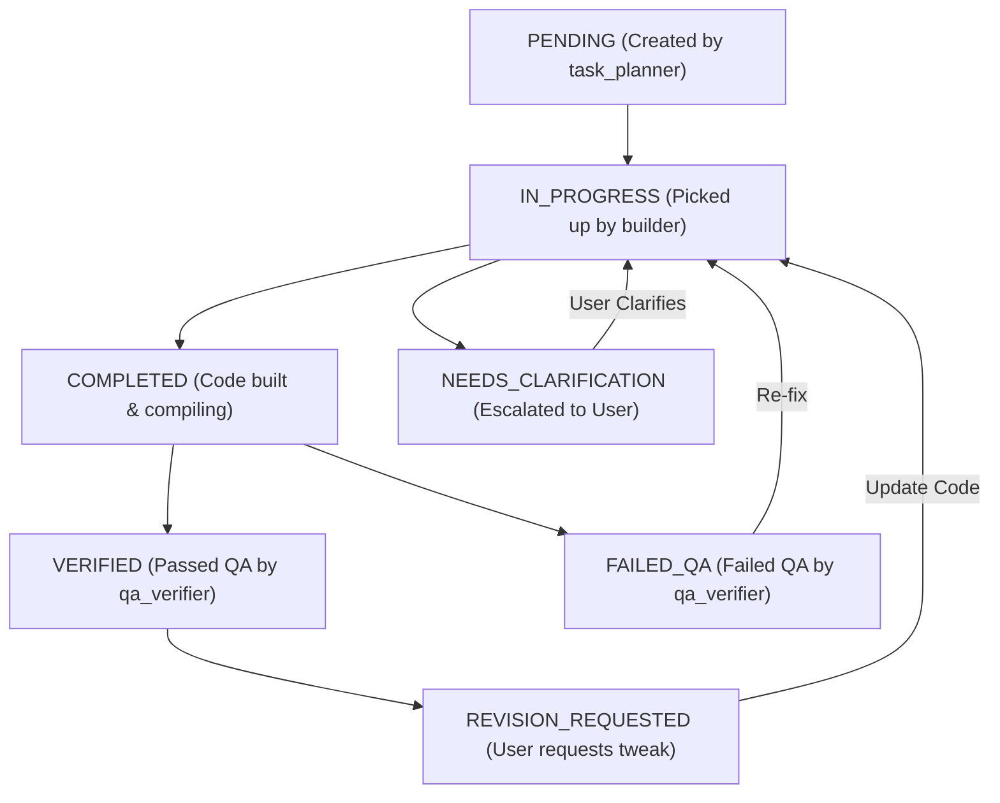

# Implementation Task Tickets (`tasks/`)

This directory contains atomic implementation task tickets generated by `task_planner` for feature specifications in `specs/` that have reached `status: APPROVED`.

---

## 1. Task Ticket Schema

Every task file in `tasks/` MUST follow this metadata schema:

```yaml
---
task_id: TASK-01
spec_id: SPEC-01
target_spec_file: specs/all/01-line-of-inquiry-v1.md
status: PENDING # PENDING | IN_PROGRESS | NEEDS_CLARIFICATION | COMPLETED | FAILED_QA | VERIFIED | REVISION_REQUESTED
assigned_agent: builder
last_updated: 2026-08-21
---
```

---

## 2. Task Ticket Lifecycle States & Transitions



### Lifecycle Status Definitions:
1. `PENDING`: Task created by `task_planner`. Awaiting `builder`.
2. `IN_PROGRESS`: `builder` subagent actively implementing code.
3. `NEEDS_CLARIFICATION`: `builder` or `task_planner` encountered ambiguity. Execution paused, escalated to Main Agent -> User.
4. `COMPLETED`: `builder` finished code implementation and clean compilation (`npm run build`). Ready for QA.
5. `FAILED_QA`: `qa_verifier` found bugs or failed acceptance criteria. Returned to `builder` with diagnostic error log.
6. `VERIFIED`: `qa_verifier` tested and confirmed task passes cleanly.
7. `REVISION_REQUESTED`: User inspected built prototype and requested specific UI/UX adjustments.

---

## 3. Subagent Clarification Flow

If `task_planner`, `builder`, or `qa_verifier` requires clarification on any requirement:
1. The subagent updates the task ticket status to `NEEDS_CLARIFICATION`.
2. The subagent appends a `## Question for User` block to the task ticket.
3. The subagent pauses execution and notifies the Main Agent.
4. The Main Agent presents the question to the User.
5. Once the User answers, the Main Agent updates the task file with the decision and sets status back to `PENDING` or `IN_PROGRESS`.

---

## 4. User Prototype Feedback & Revision Flow

When the User inspects built work and wants changes:
- **Minor Adjustments / Tweaks**: User tells Main Agent -> Main Agent sets task status to `REVISION_REQUESTED` (or creates a minor revision task ticket in `tasks/`) with User feedback notes -> `builder` updates code -> `qa_verifier` re-verifies.
- **Major Feature / Scope Changes**: User & Main Agent co-author a new spec version (e.g. `specs/all/01-line-of-inquiry-v2.md`). Once `v2` is `APPROVED` by User, `v1` becomes `DEPRECATED` and `task_planner` generates tickets for `v2`.
